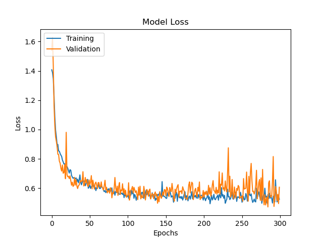

# Drums-io
Play Drums in your Browser.

Drums.io allows you to simulate in your browser any percussion instrument, by using only your Webcam. All machine learning models run locally, so no user information is sent to the server.  

### Quick Start

Simply run the <a href="./src/index.html" target="_blank"> src/index.html </a> in server mode, or enter at <a href="www.drums.io"> drums.io </a> (soon).  

Select **Play** for using a prefab drums template (coming soon), or **Set Template** for building your own by uploading some images and attaching your sounds to them.

Turn on your **webcam** and enjoy it!

NOTE: Until the webpage is uploaded to a host there are two buttons on top of the **Play** screen for uploading <a href="./src/DrumsApp/js/Resources/HitNetJS" target="_blank">HitNet</a> locally.

# Implementation Details

This web application is built with  and .  
The pipeline uses two Machine Learning models.
<ul>
  <li> <a href="https://google.github.io/mediapipe/solutions/hands#javascript-solution-api" target="_blank"><b>Hands Model</b></a>: A Computer Vision model offered by  for detecting 21 landmarks for each hand (x, y, z).</li>
  <li> <b><a href="./src/DrumsApp/js/Resources/HitNetJS" target="_blank">HitNet</a></b>: An LSTM model that has been developed in  for this application and then converted to . It takes the last N positions of a hand and predicts the probability of this sequence to correspond with a Hit.</li>
</ul>

## HitNet Details

### Building the Dataset

The dataset used for training has been built in the following way:
<ol>
  <li> A representative landmark (<i>Index Finger Dip [<b>Y</b>]</i>) of each detected hand is plotted in an interactive chart, using .</li>
  <li> Any time that a key is pressed, a grey mark is plotted on the same chart. </li>
  <li> I start to play drums with one hand while pressing a key on the keyboard (with the other hand) every time that I beat an imaginary drum. [<b>Gif Left</b>]</li>
  <li> I use the mouse for selecting in the chart those points that should be considered as a hit. [<b>Gif Right</b>]</li>
  <li> When click the "<button>Save Dataset</button>" button, all hand positions together with their correspondent tags (<b>1</b> if the frame was considered a hit or <b>0</b> otherwise) are downloaded as a <a href="./src/DrumsApp/python/dataset"> <i>JSON</i> file </a>.</li>
</ol>
  
  
  
### Defining the Architecture

HitNet has been built in , using , and then exported to . In order to not produce any dissonance between the hit on the drum and the produced sound **HitNet** must run as fast as possible, for this reason it implements an extremely simple architecture.

It takes as input the 4 last detections of a hand [<i>Flatten version of its 21 landmarks (x,y,z)</i>] and outputs the probability of this sequence to correspond with a hit. It is only composed by an <i>LSTM</i> layer followed by a <i>ReLU</i> activation (using dropout with <i>p = 0.25</i>) and a <i>Dense</i> output layer with only 1 unit, followed by a <i>sigmoid</i> activation.

### Training the model

HitNet has been trained in , using the following parameterization:
<ul>
  <li> <b>Epochs</b>: 3000.</li>
  <li> <b>Optimizer</b>: <a href="https://deepai.org/machine-learning-glossary-and-terms/adam-machine-learning" target="_blank">Adam</a>.</li>
  <li> <b>Loss</b>: Weighted <a href="https://sparrow.dev/binary-cross-entropy/" target="_blank">Binary Cross Entropy</a>*.</li>
  <li> <b>Training/Val Split</b>: 0.85-0.15.</li>
  <li> <b>Data Augmentation</b>:
    <ul>
      <li> <b>Mirroring</b>: X axis.</li>
      <li> <i><b>Shift</b>: Shift applied in block for the whole sequence.</i>
      <ul>
      <li> <b>X Shift</b>: ±0.3.</li>
      <li> <b>Y Shift</b>: ±0.3.</li>
      <li> <b>Z Shift</b>: ±0.5.</li>
      </ul>
      <li> <i><b>Interframe Noise</b>: Small shift applied independently to each frame of the sequence.</i>
      <ul>
      <li> <b>Interframe Noise X<b>: ±0.01. </li>
      <li> <b>Interframe Noise Y<b>: ±0.01. </li>
      <li> <b>Interframe Noise Z<b>: ±0.0025. </li>
      </ul>
      <li> <i><b>Intraframe Noise</b>: Extremely small shift applied independently to each single part of a hand.</i>
      <ul>
      <li> <b>Intraframe Noise X<b>: ±0.0025. </li>
      <li> <b>Intraframe Noise Y<b>: ±0.0025. </li>
      <li> <b>Intraframe Noise Z<b>: ±0.0001. </li>
      </ul>
    </ul>
   </li>
</ul>
        
The weights exported to  are not the ones of the last epoch, but the ones that maximized the Validation Loss at any intermediate epoch.  

*<i>Loss is weighted since the positive class is extremely underrepresented in the training set.</i>
        
### Analyzing Results

Confusion matrices show that results are pretty high for both classes putting the confidence threshold at 0.5.

Despite these <i>False Positives</i> and <i>False Negatives</i> could worsen the user experience in a network that is executed several times each second, it does not really affect the playtime in a real situation. It is due to three factors:
<ol>
  <li> Most <i>False Positives</i> come from the frames anterior or posterior to the hit. In practice, it is solved by emptying the sequence buffers every time that a hit is detected.</li>
  <li> The small amount of <i>False Negatives</i> detected in the train set comes from <i>Data Augmentation</i> or because it is detected on the previous or the following frame. In real cases, these displacements does not affect to the experience.</li>
  <li> The rest of <i>False Positives</i> does not use to appear in real cases since, during playtime, only the sequences including detections entering in the predefined drums are analyzed. In practice it works as <i>double check</i> for the positive cases.</li>
</ol>

Evolution of the <i>Train/Validation Loss</i> during training confirms that there has been no overfitting.

